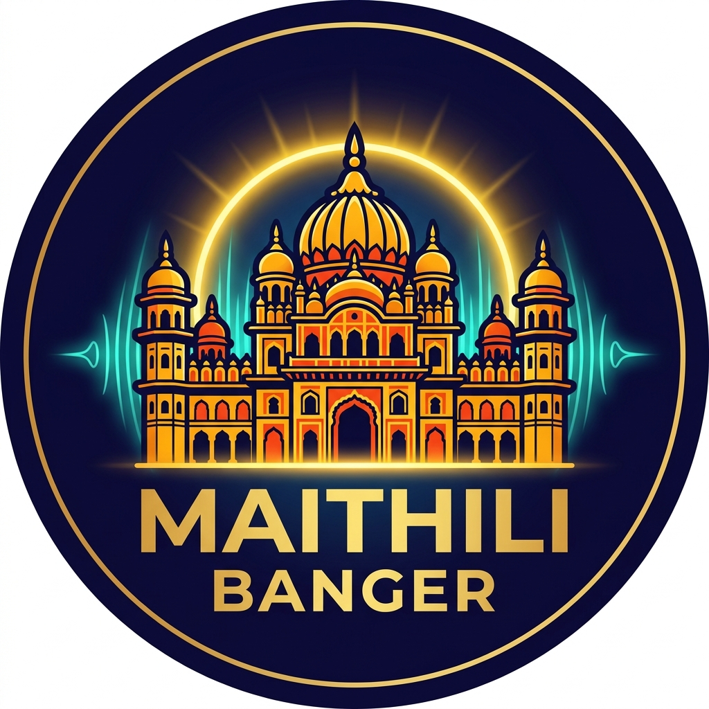

# 🎵 मैथिली Banger — Maithili Melodies Radio

<p align="center">
  
</p>

<p align="center">
  <strong>A nostalgic, aesthetic 24/7 internet radio celebrating the timeless musical heritage, folklore, and spirit of Mithila.</strong>
</p>

<p align="center">
  <a href="https://react.dev/"></a>
  <a href="https://vitejs.dev/"></a>
  <a href="https://vercel.com/"></a>
  <a href="#"></a>
</p>

---

## 🌟 Our Vision

**मैथिली Banger** was created with a heartfelt mission: **to preserve, celebrate, and circulate the rich cultural soul of Mithila to people across the globe.**

Mithila is a land of unparalleled cultural richness — the birthplace of Mata Janaki (Sita), the timeless poetry of Mahakavi Vidyapati, the world-renowned Madhubani painting traditions, and a music tradition that breathes life into every celebration, harvest, and sacred ritual. From Dr. Sharda Sinha's deeply emotional Chhath and wedding melodies to romantic folk ballads and spiritual bhajans, Maithili music carries an emotional depth unlike anything else.

This project aims to:
- 🌸 **Bridge Generations:** Introduce the younger generation and diaspora youth to the sweetness (*misaas*) of Maithili language and music.
- 🌍 **Global Access:** Provide anyone, anywhere in the world, with instant access to a continuous, uninterrupted stream of pure Maithili songs without commercial clutter.
- 🎨 **Cultural Honor:** Highlight the sacred imagery of **Janakpur Dham (Janaki Mandir)** and traditional Madhubani motifs in a modern, state-of-the-art web interface.

---

## ✨ Features

- 📻 **24/7 Nostalgic Radio:** Non-stop playback of iconic Maithili classics, folk songs, Chhath geet, and contemporary hits.
- 🔄 **Live Dynamic Playlist Sync:** Powered by a serverless scraper that automatically syncs with the live YouTube playlist — newly added songs show up on the radio dynamically within minutes.
- ⚡ **Zero-Latency Cold Start:** Pre-baked high-fidelity tracklist ensures instant playback without waiting for network requests.
- 🏛️ **Janaki Dham Aesthetic:** Custom-crafted tab favicon and branding inspired by the majestic Janaki Mandir palace architecture and Madhubani folk art.
- 👥 **Realtime Listener Presence:** Live listener count powered by Firebase Realtime Database with smooth simulated fallback.
- 🎛️ **Full-Featured Modern Player:**
  - True non-repeating Shuffle mode.
  - Interactive scrubbing progress bar with drag-to-seek.
  - Smart Volume control with memory persistence (`localStorage`).
  - Next / Previous track navigation.
  - Playlist drawer with drag-and-drop reordering.
- ⌨️ **Keyboard Navigation & Visual Toasts:**
  - `Space` — Play / Pause
  - `Right Arrow` — Next Track
  - `Left Arrow` — Previous Track
  - `M` — Mute / Unmute
  - Instant on-screen toast notifications for every keyboard action.
- 📱 **Responsive & Lightweight:** Smooth drifting background art, interactive canvas particles, and adaptive styling for mobile and desktop screens.

---

## 🛠️ Tech Stack

| Technology | Purpose |
|---|---|
| **React 19** | Modern component-driven user interface |
| **Vite 8** | Ultra-fast development server & optimized production bundling |
| **Vanilla CSS** | Tailored HSL design system with glassmorphism and animations |
| **YouTube IFrame API** | Background audio playback engine |
| **Vercel Serverless Functions** | Dynamic playlist scraper (`api/playlist.js`) with edge caching |
| **Firebase Realtime Database** | Real-time concurrent listener presence counter |

---

## 🚀 Getting Started

### Prerequisites
Make sure you have [Node.js](https://nodejs.org/) (v18 or newer) installed.

### Installation

1. **Clone the repository:**
   ```bash
   git clone https://github.com/rohitkumarchaurasiya111/Maithili_Bangers.git
   cd Maithili_Bangers
   ```

2. **Install dependencies:**
   ```bash
   npm install
   ```

3. **Start the local development server:**
   ```bash
   npm run dev
   ```
   Open `http://localhost:5173` in your browser to experience the radio!

4. **Build for production:**
   ```bash
   npm run build
   ```

---

## ☁️ Deployment

This project is optimized for deployment on **Vercel**:

### Option 1: Via GitHub & Vercel Dashboard
1. Push your repository to GitHub.
2. Go to [Vercel Dashboard](https://vercel.com/new) and import the repository.
3. Vercel automatically detects Vite and uses [`vercel.json`](./vercel.json) for static asset routing and the `/api/playlist` serverless function.

### Option 2: Via Vercel CLI
```bash
npx vercel
```

---

## 🎶 Featured Artists & Heritage

We bow with deep gratitude to the legends whose voices preserve the soul of Mithila:
- **Dr. Sharda Sinha** (Bihar Kokila) — *The immortal voice of Mithila folk, Chhath, and Vivah geet.*
- **Udit Narayan Jha** — *Legendary playback singer hailing from Mithila.*
- **Ved Sethi** — *Pioneer of traditional Maithili recordings.*
- **Maithili Thakur** — *Modern torchbearer of Maithili folk melodies.*
- **Shiwani Bhagat, Rajeev Ranjan, Rohit Sharma, & all folk artists** keeping our traditions alive.

---

## 🤝 Contributing

Contributions to expand the track library, improve UI aesthetics, or add new cultural features are warmly welcomed!
1. Fork the Project
2. Create your Feature Branch (`git checkout -b feature/AmazingFeature`)
3. Commit your Changes (`git commit -m 'Add some AmazingFeature'`)
4. Push to the Branch (`git push origin feature/AmazingFeature`)
5. Open a Pull Request

---

## 📜 License & Credits

- **Concept & Development:** [Rohit](https://www.linkedin.com/in/rohit-kumar-chaurasiya-0862b1272/) (`print_Rohit`)
- **Culture & Heritage:** Dedicated to all Maithils worldwide and the holy land of **Janakpur Dham**.

<p align="center">
  <strong>जय मिथिला, जय जानकी! 🚩</strong>
</p>
